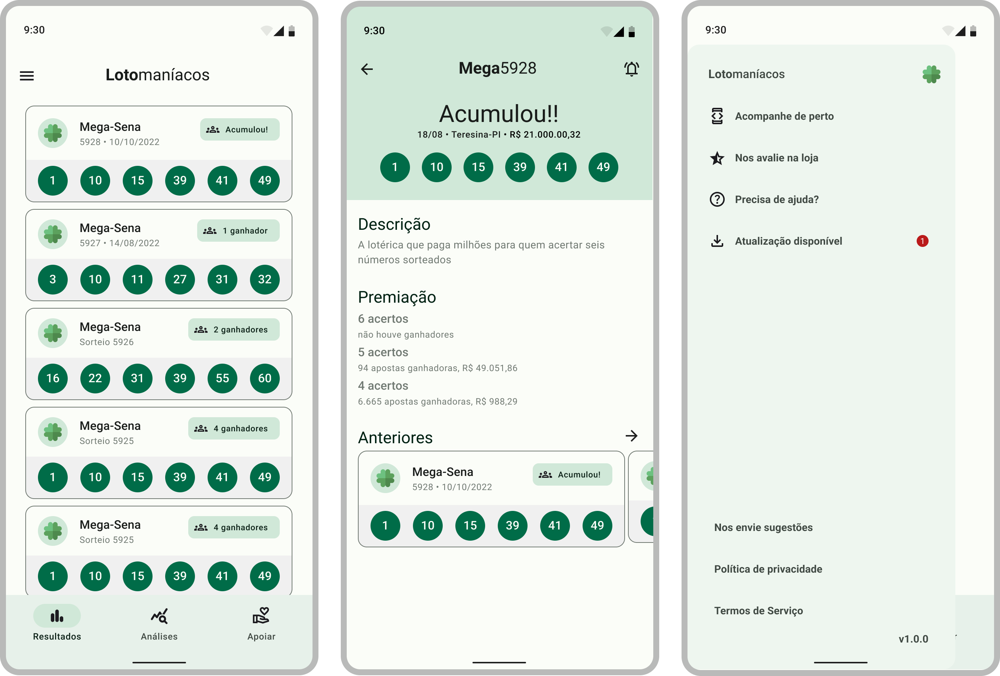

🍀 Lotonáticos
==================
**Lotonáticos**  é um aplicativo android nativo inteiramente desenvolvido em Kotlin e Jetpack Compose. Seguindo boas práticas de design e desenvolvimento com o principal objetivo servir de exemplo para jovens desenvolvedores.

Neste aplicativo o usuário será capaz de acompanhar e receber alertas dos jogos da lotérica da caixa tanto em seu celular, quanto relógio e whatsapp/telegram.

## Funcionalidades
É possível acompanhar detalhes do [Roadmap aqui.](https://github.com/users/VictorHVS/projects/6/views/1). Hoje o usuário pode ver os últimos 15 jogos da mega-sena, mas em breve será implementado: Detalhes do Jogo, push notification, widget e outros jogos das lotéricas.

## 🛠️ Tech Stack

- [Kotlin](https://kotlinlang.org/) - Linguagem recomendada para o desenvolvimento de aplicativos nativos Android.
- [Firebase](https://firebase.com/) - Plataforma mantida pela Google que auxilia na construção e escala de apps.
  - Auth
  - Firestore
  - Cloud Functions
  - App Check
- [Jetpack Compose](https://developer.android.com/jetpack/compose) - O Jetpack Compose é um kit de ferramentas moderno do Android para criar IUs nativas. Ele simplifica e acelera o desenvolvimento da IU no Android. Dê vida ao seu app rapidamente com menos código, ferramentas eficientes e APIs Kotlin intuitivas.
- [Material Design 3](https://m3.material.io/) - A última versão do Material Design.
- [Figma](https://www.figma.com/file/v8s5cnu3xwwpLfawnVW8yT/Loton%C3%A1ticos?node-id=51495%3A4712) - É um editor gráfico de vetor e prototipagem de projetos de design.

## 📃 Artigos
- [Firebase: Evitando falir antes de monetizar seu projeto](https://medium.com/@victorhvs/firebase-evitando-falir-antes-de-monetizar-seu-projeto-20e346fe59f7)

## 👍 Contribua

Se você quiser contribuir ou apoiar o desenvolvimento deste projeto de forma mais ativa:

1. Adicione uma [estrela no GitHub](https://github.com/VictorHVS/lotonaticos/stargazers) no projeto.
2. Baixe e avaliar o app na [Google Play](https://play.google.com/store/apps/details?id=com.victorhvs.lotonaticos).
3. Escreva sobre no [Medium](https://medium.com/), [Dev.to](https://dev.to/) ou blog pessoal.
4. Patrocine o **🍀 Lotonáticos** doando um [**cafezinho ☕**](https://buymeacoff.ee/victorhvs)

## 🧑‍💻 Entre em contato

- Victor Hugo - [@victorhvs_](https://twitter.com/victorhvs_)